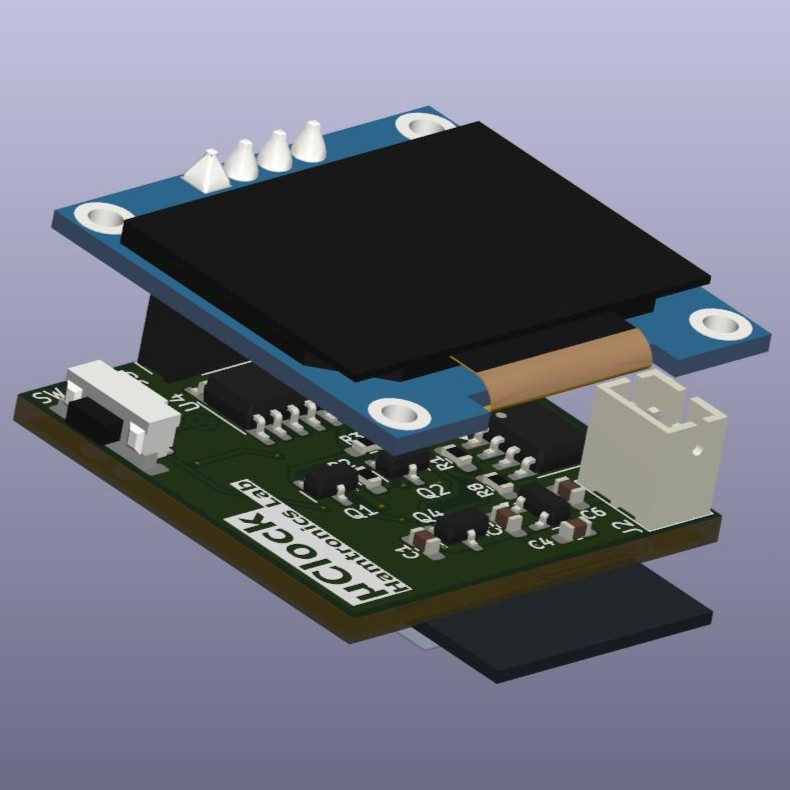

# μClock

**μClock** is a sleek, ultra-precise handheld digital clock — built for makers, engineers, and time enthusiasts who value accuracy, simplicity, and reliability.

Powered by the **ESP8285**, μClock connects to Wi-Fi and automatically syncs with **NTP servers**, ensuring it's always perfectly on time.

## Features

- ESP8285 + 0.96" OLED
- NTP sync over Wi-Fi
- Time zone selection
- Open source and customizable

> Work in progress — more updates coming soon.
